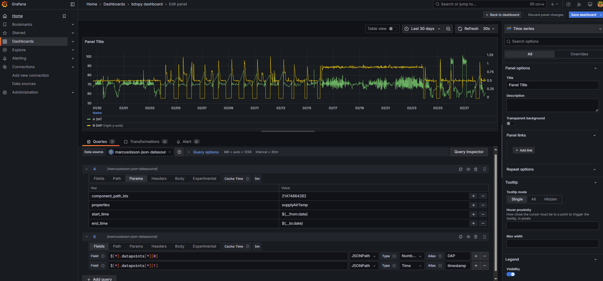

# Setting Up BDXpy as a Data Service for Grafana

This guide walks you through setting up BDXpy as a FastAPI data service on a Grafana server and configuring it as a JSON API data source.




## 1. Install Dependencies
Ensure you have Python 3.12+ installed. Install the necessary dependencies:
    ```python  
        pip install fastapi uvicorn pandas requests python-dotenv
    ```
## 2. Set Up Environment Variables

Create a .env file to store your BDX credentials securely:
    ```python  
        BDX_URL="https://your-bdx-instance.com"
        BDX_USER="your-username"
        BDX_PASS="your-password"
    ```
**Note:** your server the data service is being run on will need access to reach the bdx URL
**Because BDXpy handles authentication on additional authentication is needed in grafana.**

## 3. Implement the FastAPI Service
Create a file bdx_service.py and define the API:

    ```python
        from fastapi import FastAPI, Query, HTTPException, BackgroundTasks, Request
        from fastapi.responses import JSONResponse 
        import pandas as pd
        import uvicorn
        import os
        import logging
        import json
        from datetime import datetime, timedelta, timezone
        from dotenv import load_dotenv
        from slowapi import Limiter
        from slowapi.util import get_remote_address
        from typing import List, Optional
        from memory_profiler import profile

        # Import BDXpy modules
        from bdx.core import BDX
        from bdx.auth import UsernameAndPasswordAuthenticator
        from bdx.trending import PropertyDescriptor
        from bdx.types import TimeFrame, AggregationLevel

        # Configure Logging
        logger = logging.getLogger(__name__)
        log_handler = logging.handlers.RotatingFileHandler("api.log", maxBytes=100*1024*1024, backupCount=5)
        logger.setLevel(logging.DEBUG)
        log_handler.setFormatter(logging.Formatter("%(asctime)s - %(levelname)s - %(message)s"))
        logger.addHandler(log_handler)

        def log_event(level, message, extra=None):
            log_entry = {
                "level": level, 
                "message": message, 
                "timestamp": datetime.now(timezone.utc).isoformat()
            }
            if extra:
                try:
                    json.dumps(extra)  # Ensure extra is JSON serializable
                    log_entry["extra"] = extra
                except TypeError:
                    log_entry["extra"] = str(extra)  # Convert non-serializable objects to strings
            logger.log(level, json.dumps(log_entry))

        # Load environment variables
        load_dotenv()
        BDX_URL = os.getenv("BDX_URL")
        BDX_USER = os.getenv("BDX_USER")
        BDX_PASS = os.getenv("BDX_PASS")

        # Initialize Rate Limiting
        limiter = Limiter(key_func=get_remote_address)

        # FastAPI app
        app = FastAPI()

        # Initialize BDX connection
        authenticator = UsernameAndPasswordAuthenticator(BDX_USER, BDX_PASS)
        bdx_instance = BDX(BDX_URL, authenticator)

        @app.middleware("http")
        async def error_middleware(request: Request, call_next):
            try:
                return await call_next(request)
            except Exception as e:
                log_event(logging.ERROR, f"Unhandled error: {e}", {"request_path": request.url.path})
                return JSONResponse(
                    status_code=500,
                    content={"message": "Internal Server Error"}
                )

        @app.get("/query")
        @limiter.limit("20/minute")
        async def query_grafana(
            request: Request,
            background_tasks: BackgroundTasks,
            component_path_ids: str = Query(..., title="Comma-separated list of Component Path IDs"),  
            properties: str = Query("value", title="Comma-separated list of properties"),  
            start_time: Optional[str] = Query(None, title="Start Time (ISO 8601, default: 24h ago)"),
            end_time: Optional[str] = Query(None, title="End Time (ISO 8601, default: now)")
        ):
            log_event(logging.DEBUG, "Raw query parameters", {"query_params": dict(request.query_params)})
            
            try:
                component_path_ids_list = list(map(int, component_path_ids.split(",")))
                properties_list = properties.split(",")

                if not start_time:
                    start_time = (datetime.now(timezone.utc) - timedelta(hours=24)).isoformat()
                if not end_time:
                    end_time = datetime.now(timezone.utc).isoformat()

                log_event(logging.DEBUG, "Parsed query parameters", {
                    "component_path_ids": component_path_ids_list,
                    "properties": properties_list,
                    "start_time": start_time,
                    "end_time": end_time
                })

                response = await get_bdxpy_trend_data(bdx_instance, component_path_ids_list, properties_list, start_time, end_time)
                return response
            except Exception as e:
                log_event(logging.ERROR, f"Unexpected error in query processing: {str(e)}")
                raise HTTPException(status_code=500, detail="Internal server error")


        async def get_bdxpy_trend_data(bdx_instance, component_path_ids: List[int], properties: List[str], start_time: str, end_time: str):
            try:
                log_event(logging.DEBUG, "Fetching BDXpy data", {
                    "component_path_ids": component_path_ids,
                    "properties": properties,
                    "start_time": start_time,
                    "end_time": end_time
                })
                
                trending = bdx_instance.trending
                start_dt = datetime.fromisoformat(start_time).astimezone(timezone.utc)
                end_dt = datetime.fromisoformat(end_time).astimezone(timezone.utc)
                timeframe = TimeFrame(start=start_dt, end=end_dt)
                
                property_descriptors = [
                    PropertyDescriptor(componentPathId=comp_id, propertyName=prop)
                    for comp_id in component_path_ids
                    for prop in properties
                ]
                
                trend_data = trending.retrieve_data(properties=property_descriptors, timeframe=timeframe, aggregation_level=AggregationLevel.POINT)
                df = trend_data.dataframe
                
                log_event(logging.DEBUG, "Received DataFrame", {"df_shape": df.shape, "df_columns": list(df.columns)})
                
                if df.empty:
                    log_event(logging.WARNING, "No data returned from BDXpy.")
                    return {"message": "No data available"}
                
                if 'time' in df.columns:
                    df['time'] = pd.to_datetime(df['time'], utc=True)  # Ensure 'time' column is datetime
                    df.set_index('time', inplace=True)  # Set 'time' as the index

                print(df)
                
                response = [
                    {
                        "target": column.split('_')[-1],  # Remove component ID prefix to match Grafana target names
                        "datapoints": [
                            [value, int(pd.Timestamp(timestamp).timestamp() * 1000)]
                            for timestamp, value in df[column].items() if pd.notna(timestamp) and not pd.isnull(value)
                        ]
                    }
                    for column in df.columns if column != 'time'
                ]
                return response
            except Exception as e:
                log_event(logging.ERROR, f"Error fetching BDXpy data: {e}")
                raise HTTPException(status_code=500, detail="Internal Server Error")

        @app.get("/")
        async def root():
            return {"message": "BDXpy API for Grafana"}

        if __name__ == "__main__":
            uvicorn.run(app, host="127.0.0.1", port=8000)
    ```
## 4. Run the API Service
Start the service:
    ```python  
        python bdx_service.py
    ```
Your FastAPI service is now running on **port 8000**.
**Note:** if this is a important process you will want to create additional monitoring and error checking and maybe expand service restart scenarios to ensure high uptime

## 5. Configure Grafana

- **Install JSON API**

- **Add a New Data Source in Grafana**:
  - Navigate to **Configuration → Data Sources → Add Data Source**.
  - Select **"JSON API"**.
  - Set:
    - **URL**: `http://localhost:8000`
    - **Method**: `GET`
  - Click **Save & Test**.

- **Create a Panel**:
  - Go to **Dashboards → Create → New Panel**.
  - Choose the **JSON API** data source.
  - Set the **Query Path** to `/query`.
  - Add **Query Parameters**:
    - `component_path_ids=21474864282`
    - `properties=supplyAirTemp,ductStaticPressure`
    - `start_time=${__from:date}`
    - `end_time=${__to:date}`

- **Format Response in Grafana**:
  - Use **JSONPath Queries** to extract data:
    ```json
    [
      {
        "name": "value",
        "jsonPath": "$[*].datapoints[*][0]",
        "type": "number"
      },
      {
        "name": "timestamp",
        "jsonPath": "$[*].datapoints[*][1]",
        "type": "time"
      },
      {
        "name": "metric",
        "jsonPath": "$[*].target",
        "type": "string"
      }
    ]
    ```

## 6. Verify Data in Grafana

- Ensure your **panel correctly visualizes each series separately**.
- If a **boolean point** (e.g., `supplyFanStatus`) is coming back **null**, check:
  - The **property name** in BDX.
  - The **data type** (it may need conversion to `1/0` instead of `true/false`).

## 7. (Optional) Enable Secondary Y-Axis in Grafana

To plot **multiple metrics** with different scales:
- Go to **Panel Settings → Axes**.
- Under **Y-Axis**, set:
  - **Y-Axis 1** for `supplyAirTemp`
  - **Y-Axis 2** for `ductStaticPressure`

## 8. (Optional) Add Background Shading for Boolean Points

To visualize a **Boolean** (`True/False`) metric:
- Use **Field Overrides**:
  - Set a **Threshold** (e.g., `1 = ON` / `0 = OFF`).
  - Change **background color** dynamically based on status.
