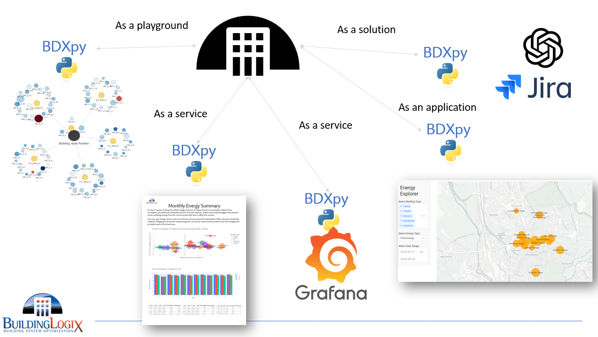
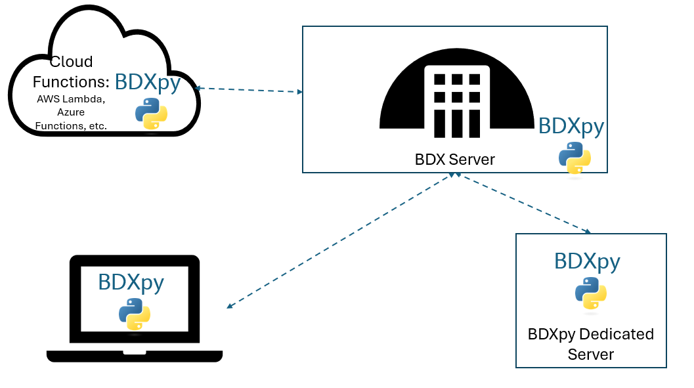
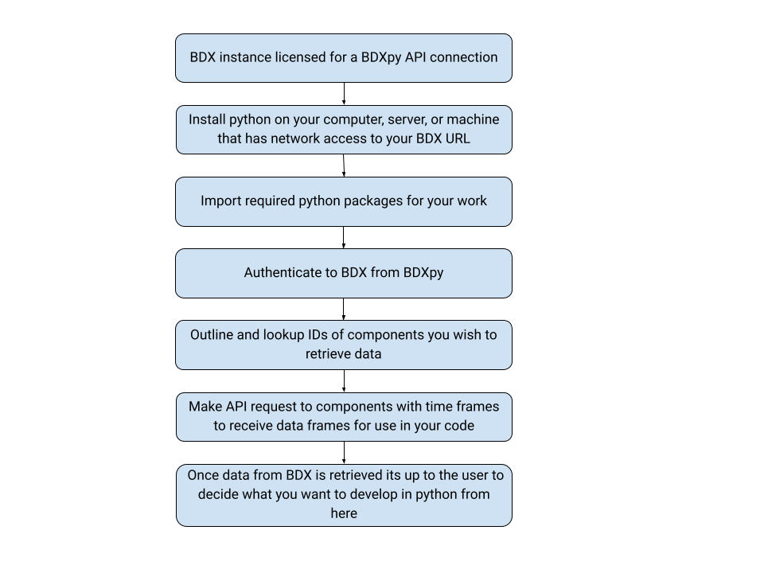
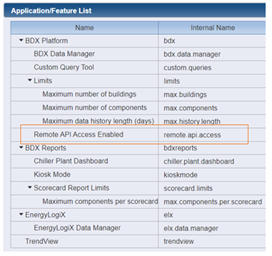

# Getting Started

## Applications and Use Cases

BDXpy is a powerful companion tool for use with BDX installations. This tool designed for advanced users who need to interface with the BuildingLogiX Data Exchange (BDX) platform for retrieving, processing, and analyzing building performance data in a complex/customized way. While we prefer to develop all great ideas into the main BDX development roadmap, BDXpy gives use the ability NOW to bring their own ideas to life or create value in ways that might not make sense as a one off project in BDX.

Some key applications include:

- **As a Data Playground** – Automate the retrieval of historical and real-time energy consumption data for custom reporting and analysis.
- **As a Data Service** – run BDXpy inside automated reports or on servers as an API service. For example in Grafana dashboards or weekly energy/FDD summaries of your buildings major KPIs.
- **As an Application** – Build interactive public dashboards for stakeholder using Flask, Dash, or other web frameworks.
- **As a Solution** – Extract data from BDX and integrate it with other platforms, including cloud databases, CMMS, and BI tools. Maybe create automated analysis and summaries for issues with AI assitants??

**Note: BDXpy development is custom to each end user and each BDX site. The responsibility of best practices around coding, data retrievals, architecture, and deployment practices are yours. Unless contracted BuildingLogiX is not responsible nor warrants user created scripts, programs, etc.**

BuildingLogiX is providing a pathway for advanced capabilities and a gateway to large volumes of organized data. If you wish to have a consultant or use BuildingLogiX in your development with BDXpy we are happy to engage members of our development and engineering teams. Reach us at technical.support@buildinglogix.net


## Why Python?

BDXpy was built using **Python** because of its flexibility, powerful capabilities, and vast ecosystem of open-source libraries. Python is widely used in data science, automation, and web applications, making it an ideal choice for interacting with the **BuildingLogiX Data Exchange (BDX)** platform.

### Key Reasons For Choosing Python:


- **Ease of Use & Readability** – Python's simple syntax makes it accessible for both beginners and advanced users, allowing for rapid development and maintainability.
- **Large Open-Source Community** – Python has one of the largest and most active developer communities, ensuring extensive support, tutorials, and libraries for virtually any task.
- **Rich Data Science Ecosystem** – Libraries like **pandas**, **NumPy**, and **Matplotlib** enable powerful data manipulation, statistical analysis, and visualization.
- **Scalability & Performance** – Python can be used for quick prototyping as well as large-scale applications, supporting both small scripts and enterprise-level solutions.
- **Extensive Integration Options** – Python easily integrates with databases, web services, cloud platforms (AWS, Azure, GCP), and APIs, making it the perfect language for automation and analytics.
- **Cross-Platform Compatibility** – Python runs on **Windows, macOS, and Linux**, ensuring that BDXpy can be deployed across different environments with minimal setup.
- **Automation & Scripting** – Python excels at automating repetitive tasks, scheduling reports, and managing data pipelines with minimal effort.

By leveraging Python’s strengths, **BDXpy** provides a robust, scalable, and easy-to-use interface for working with BDX, empowering users to extract insights, automate processes, and build custom applications.


## Architecture Options
There are a couple different ways to run/deploy BDXpy depending on your needs and use cases. Technically multiple sources of BDXpy could be running simultaneously performing various tasks.  
**Disclaimer:** BDXpy is intended for power users and rates of data collection should be reasonable and if too many requests of large quantities of data  are simultaneously taking place it could strain the BDX application and database servers as well as the local machine hosting BDXpy as large data frames can become memory intensive. BDXpy limitations are dependent both on the location of its operation but also the BDX instance it communicates with. It’s the responsibility of the user to make smart decisions with this knowledge.
BDXpy (as the below image suggests) can be used on an existing BDX server, on a dedicated server, or run from a laptop/computer. In all cases the network path between the BDX instance and BDXpy needs to be active for scripts and processes using BDXpy to work.

### Deployment Cases
1. **On a laptop/personal computer:** for engineers wanting to experiment, run reports from their machine, non-24/7 script deployments.
    - Easiest way to get started or pilot something before deploying elsewhere so long as user has access to BDX from laptop
- **On an existing BDX server:** likely for an on-premises installation where data is served back to BDX via Windows IIS and are publishing BDXpy internally with identical firewall rules to BDX.
    - Install here if you want BDXpy files to feedback to the kiosk or custom apps/widgets. Maybe require IT approval or cooperation
- **On a dedicated BDXpy server:** user who might have a cloud BDX but locally want to serve up private network, but internal (non-authenticated) dashboard/visuals/kiosks on a local network. Or users who have more powerful tasks or server resources or teams that shouldn’t/can’t access the BDX server RDP directly or who want to have scripts automatically run on a timed/automated schedule
    - Dedicated servers could also be cloud VMs if they have access to BDX where automated reports or new apps are created. Doesn’t require extra IT permissions or resources on the BDX server depending on the scope.
- **Cloud Functions:** BDXpy scripts can be run in serverless environments such as AWS Lambda or Azure Functions provided, they don’t entail long running or complex processes or other serverless constraints and have access to communicate with the BDX instance/server. See cloud provider for details




## Process Overview – From BDX to BDXpy and Python Outputs



### Checking the BDX license for BDXpy
BDXpy requires a license feature on the source BDX. These can be viewed in a BDX instance under **Manage Licenses** to ensure the feature is enabled as in the image below.✅



### Installation

Installing the BDX Python package is relatively simple. The first thing required is to download the Python language onto your device.

1. BDXpy requires Python 3.12 or newer versions (newer versions are recommended). This can be done through the Python downloads website.
2. Ensure BDX instance is licensed for API access.
3. After installing the necessary packages and obtaining the correct licensing, install BDXpy just like any other Python package:

```python
pip install bdxpy
```
Information on pip [here](https://pypi.org/).

### Requirements packaged that come with BDXpy
BDXpy requires Python 3.12+ and the following dependencies which will be installed with BDXpy:

- requests
- pandas
- nacl
- urllib3
- dacite

Note: you do not need to install these separately as they come with BDXpy, this is purely for reference.

### BDXpy Imports 
To make use of bdxpy functions python will need “imports” from the package. These imports reside before the code/functions are called in the python script and are all typically handled in the beginning lines of the code like below:

```python
from bdx.auth import UsernameAndPasswordAuthenticator
from bdx.core import BDX
from bdx.types import TimeFrame
from bdx.components import Components

## examples of other python package imports (but not limited to) that can be used with data from BDXpy
from datetime import datetime, timedelta
import os
from dotenv import load_dotenv
import pandas as pd
import re
import matplotlib.pyplot as plt
```


## BDXpy License
This package is distributed under a proprietary license. Contact BuildingLogiX for licensing information.

Learn more about BuildingLogiX Data Exchange (BDX) [here](https://buildinglogix.net/connected-buildings/buildinglogix-data-exchange-bdx/).
BDXpy on [pypi](https://pypi.org/project/bdxpy/).