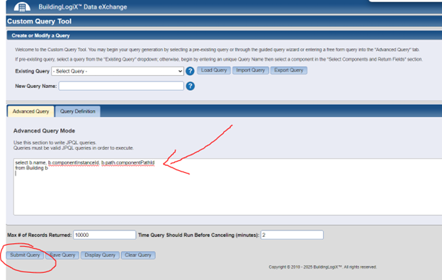

# Reference

##	Authentication and Session Setup

### Using a .env File for Credentials
To enhance security, you can store the username and password in a .env file rather than hardcoding them into your python code. 
Note: Files containing the credentials should have appropriate security practices in place such as user/server permissions so they cannot be accessed/stolen/or compromised. 
Below are the examples to set up and use a .env file for authentication. More on this process and security can also be found online.

1. Create a .env File
In your project directory, create a file named .env with the following content:
```
BDX_USERNAME=your_username
BDX_PASSWORD=your_password
```
2. Install the python-dotenv Library
Install the library to load environment variables from the .env file:
```python 
pip install python-dotenv
```
3. Load Environment Variables in Your Script
Use the following code to load the .env file and authenticate with BDX:

```python 
from dotenv import load_dotenv
import os
from bdx.auth import UsernameAndPasswordAuthenticator
from bdx.core import BDX

# Specify the path to the environment variable file
load_dotenv(dotenv_path=r"C:\Users\your-path\.env")

username = os.getenv("BDX_USERNAME")
password = os.getenv("BDX_PASSWORD")

if not username or not password:
    raise EnvironmentError("Environment variables BDX_USERNAME and BDX_PASSWORD must be set in the .env file")

authenticator = UsernameAndPasswordAuthenticator(username, password)
with BDX("http://yourBDXURL.com", authenticator) as bdx_instance:

    print("Connection successful!") 
```
### Credentials in script
For testing purposes the BDX_USERNAME and BDX_PASSWORD can also be copied into the authentication in python.

```python 
with BDX("http://yourBDXURL.com", UsernameAndPasswordAuthenticator(
  "BDX_USERNAME", "BDX_PASSWORD")) as bdx_instance:
```

### Important Notes on Authentication

- Currently, the authentication method requires the user to be a BDX local user or an LDAP user. Users authenticated via Single Sign-On (SSO) or Multi-Factor Authentication (MFA) are not supported or applicable by BDXpy.
- Ensure you have a local BDX username and password for successful authentication that is dedicated to BDXpy. Do not use regular usernames or admin credentials for reoccurring scripts.
- The credentials used for BDXpy must have BDX security permissions to access the data you are requesting as well as the BDX permissions listed below:
    - **BDXUser**
    - **TrendViewDataAccess**


- And any device/building/system read permissions necessary found under **Manage Path Access** if Object Level Security is enabled in BDX.
- BDXpy is generally intended for use by advanced power users and admin users  even with basic permissions in the BDX app its important to secure your credentials and appoint a BDXpy lead to ensure all uses of the product are being authorized and managed properly.
- From an authentication perspective BDXpy should be limited in the users BDXpy calls from for audit log and tracking practices. (aka a limited number of users of a single BDX instance and not for mass use by basic security users).

## Component Retrieval Structure
BDXpy uses `componentPathId` to call devices and properties. This applies to buildings and all child devices in BDX. `componentPathId` is the unique identifier path from the source data agent or parent BDX properties in the hierarchy of devices.

> **Note:** `componentPathId != componentInstanceID`

### Component Structure Analogy
- **Component path**: "File path" of a component.
- **Component path ID**: "File inode number."
  - This is what BDXpy will use in component retrieval.
- **Component instance ID**: File version.

### Defining Devices for Data Retrieval
Before retrieving data, a user needs to define a set of devices to pull properties from, which will require outlining the `componentPathId`s of these devices.

#### Methods to Lookup `componentPathId`
1. Use methods in BDXpy to lookup or call `componentPathId`.
2. Manually find the `componentPathId` under **Manage Device Information** in BDX.
3. Lookup information in the **Custom Query Tool** in BDX.

---

### Overview of Methods to Get `componentPathId`

In its simplest form, a `componentPathId` can be found if you know the `componentInstanceId`.

#### Example: Retrieve a Component by Instance ID

```python
from dotenv import load_dotenv
import os
from bdx.auth import UsernameAndPasswordAuthenticator
from bdx.core import BDX

# Specify the path to the environment variable file
load_dotenv(dotenv_path=r"C:\Users\your-path\.env")

username = os.getenv("BDX_USERNAME")
password = os.getenv("BDX_PASSWORD")

if not username or not password:
    raise EnvironmentError("Environment variables BDX_USERNAME and BDX_PASSWORD must be set in the .env file")

authenticator = UsernameAndPasswordAuthenticator(username, password)
with BDX("http://yourBDXURL.com", authenticator) as bdx_instance:

    print("Authenticated successfully!")

    # Retrieve component by ID
    component_instance_id = 8590005002

    component = bdx_instance.components.by_id(component_instance_id)
        
    # Extract component details
    component_name = component.path.displayName
    full_path = component.path.displayFullPath
    component_path_id = component.path.componentPathId

    print(f"Component Name: {component_name}")
    print(f"Component Inst ID: {component_instance_id}")
    print(f"Component Full Path: {full_path}")
    print(f"Component Path ID: {component_path_id}")
```

Output:
```
Authenticated successfully!
Component Name: BuildingLogiX Campus
Component Inst ID: 4294967534
Component Full Path: /Buildings/BuildingLogiX Campus
Component Path ID: 4294967534
```

If you know a building ID you can then print out all its components and their IDs:

```python
from bdx.auth import UsernameAndPasswordAuthenticator
from bdx.core import BDX
from bdx.types import TimeFrame, AggregationLevel
import pandas as pd
from dotenv import load_dotenv
import os

def get_component_table(bdx_instance, building_id):
    try:
        # Retrieve components by building ID
        components = bdx_instance.components.by_building(building_id)

        # Create a list to hold the component details
        component_data = []

        # Loop through the components and collect the details
        for component in components:
            # Extract component details
            component_name = component.path.displayName
            full_path = component.path.displayFullPath
            component_path_id = component.path.componentPathId
            component_instance_id = component.componentInstanceId  # Add component instance ID
            entity_type = component.entityTypeName  # Component type
            template_type = component.templateType  # Template type
            
            # Append to the component_data list
            component_data.append({
                'Component Name': component_name,
                'Full Path': full_path,
                'Component Path ID': component_path_id,
                'Component Instance ID': component_instance_id,  # New column
                'Entity Type': entity_type,  # Add component type
                'Template Type': template_type  # Add template type
            })

        # Convert the list into a Pandas DataFrame
        df = pd.DataFrame(component_data)
        
        # Write DataFrame to CSV
        file_path = r'C:yourPath\BDXpy\component_data.csv'
        df.to_csv(file_path, index=False)

        return df  # Return the DataFrame

    except Exception as e:
        print(f"Error retrieving components: {str(e)}")
        return None

# Use this function in the run method like this:
def run():
    with BDX("https://yourBDXURL.com", UsernameAndPasswordAuthenticator("BDX_USERNAME", "BDX_PASSWORD")) as bdx_instance:

        # Retrieve components by building ID
        building_id = 4294967302  # Replace with your actual Building ID
        
        # Get the table of components
        component_table = get_component_table(bdx_instance, building_id)
        
        # Display the table
        if component_table is not None:
            print(component_table)

if __name__ == "__main__":
    run()

```
CSV output:  


#### Example: Building ID Retrieval
To retrieve building data, use the buildings module. The list() method retrieves summaries of all accessible buildings.

```python
from dotenv import load_dotenv
import os
from bdx.auth import UsernameAndPasswordAuthenticator
from bdx.core import BDX
import pandas as pd

# Specify the path to the environment variable file
load_dotenv(dotenv_path=r"C:\Users\your-path\.env")

username = os.getenv("BDX_USERNAME")
password = os.getenv("BDX_PASSWORD")

if not username or not password:
    raise EnvironmentError("Environment variables BDX_USERNAME and BDX_PASSWORD must be set in the .env file")

authenticator = UsernameAndPasswordAuthenticator(username, password)
with BDX("http://yourBDXURL.com", authenticator) as bdx_instance:

    print("Authenticated successfully!")

###### Retrieve building summaries for all buildings in your BDX site ######
building_summaries = bdx_instance.buildings.list()

# Convert building summaries to a DataFrame
data = [
    {
        "Building Name": building.name,
        "Building ID": building.componentInstanceId,
        "Square Footage": building.sqft,
        "Address": f"{building.address.addr1}, {building.address.city}, {building.address.state}"

    }
    for building in building_summaries
]
building_df = pd.DataFrame(data)

# Display the first few rows of the DataFrame
print(building_df)
```
Output:  


### Manage Device Information in BDX 
Within BDX, users can navigate to Manage Device Information in the upper left navigation. There user can navigate the BDX buildings, hierarchy, and device to look information. This includes the ability to get `componentInstanceId` which can then be translated with BDXpy to `componentPathId` per the code below.


```python
# Retrieve component by ID
compInstID = 4294967535
component = bdx.components.by_id(compInstID)
# Extract component details
component_name = component.path.displayName
full_path = component.path.displayFullPath
component_path_id = component.path.componentPathId

print(f"Component Name: {component_name}")
print(f"Component Inst ID: {compInstID}")
print(f"Component Full Path: {full_path}")
print(f"Component Path ID: {component_path_id}")
```

### Custom Query Tool lookup in BDX
Navigate to the Custom Query Tool in your BDX instance. In the Advanced Query Mode the various query text below can be pasted and run to retrieve `componentPathId`.

#### Building lookup
This is an example advanced query that can be run from BDX to return values.

`select b.name, b.componentInstanceId, b.path.componentPathId 
from Building b```



#### "Raw" assigned point ID lookups
The query below looks up any assigned folder or raw points listed under the building (see **Manage Buildings > Assigned Point Folders List** in BDX). Users can specify/filter the building name in the BDX query below.

`select pf.folderPathAlias,  pf.folderPath.fullPath, pf.folderPath.componentPathId, pf.folderPath.currentComponent.componentInstanceId
from Building b 
join b.assignedPointFolders pf 
where b.name = 'BuildingLogiX Campus'`


### Built-in Component Filtering

`ComponentFilter` is a filtering mechanism used in **BDXpy** to refine searches when retrieving building components. It allows filtering by specific attributes like template type, path keyword, and subscription status.

```python
from bdx.core import BDX
from bdx.components import ComponentFilter
```

#### Attributes
- `template_type` *(str, optional)* – The template type of the component, such as "VAV" for Variable Air Volume boxes.
- `path_keyword` *(str, optional)* – A keyword to search for within the component’s path. If filtering by template type alone, this must be set to an empty string (""), otherwise, a 500 error will occur.
- `only_subscribed` *(bool, default False)* – If True, filters only components that are subscribed.

#### Usage Examples
Retrieving VAV Components by Path Keyword
To retrieve all VAV components assigned to a building, filtering by a specific keyword in the path:

```python
filter = ComponentFilter()
filter.template_type = "VAV"
filter.path_keyword = "AHU_1_VAVs"

print(b.components.by_building(4294967304, filter))
```
This retrieves all VAV components associated with the building ID 4294967304 that contain "AHU_1_VAVs" anywhere in their path.

##### Filtering by Template Type Alone
If filtering by template type only, the path_keyword must be set to an empty string:

```python
filter = ComponentFilter()
filter.template_type = "VAV"
filter.path_keyword = ""  # Must be explicitly set to avoid error

print(b.components.by_building(4294967304, filter))
```

##### Retrieving Only Subscribed Components
To fetch only subscribed components, set only_subscribed to True:

```python
filter = ComponentFilter()
filter.template_type = "VAV"
filter.path_keyword = "AHU_1_VAVs"
filter.only_subscribed = True

print(b.components.by_building(4294967304, filter))
This will return only components that meet the filtering criteria and are subscribed.
Searching All Buildings for a Filter
To can search the entire BDX site for components with a certain name by looping through all buildings and applying filters to the components assigned to each building.
import pandas as pd
from bdx.core import BDX
from bdx.auth import UsernameAndPasswordAuthenticator
from bdx.components import ComponentFilter

# Authenticate and initialize BDX
auth = UsernameAndPasswordAuthenticator("your_username", "your_password")
bdx_instance = BDX("https://your-bdx-instance.com", auth)

# Get a list of all buildings
building_summaries = bdx_instance.buildings.list()

# Create a filter to search for components
filter = ComponentFilter()
filter.template_type = "VAV"
filter.path_keyword = "AHU_1_VAVs"  # Adjust search term

# Store results in a list
all_components = []

for building in building_summaries:
    building_id = building.componentInstanceId
    print(f"Searching in building: {building.name} (ID: {building_id})")

    # Retrieve components matching the filter in this building
    components = bdx_instance.components.by_building(building_id, filter)

    # Add retrieved components to the list
    for comp in components:
        all_components.append({
            "Building Name": building.name,
            "Building ID": building_id,
            "Component ID": comp.componentInstanceId,
            "Component Path ID": comp.path.componentPathId if comp.path else None,
            "Template Type": comp.templateType,
            "Path": comp.path.fullPath if comp.path else None,
            "Display Name": comp.path.displayName if comp.path else None,
            "Data Collection ID": comp.path.clientDataCollectionId if comp.path else None
        })

# Convert to DataFrame
df = pd.DataFrame(all_components)

# Display the results
print(df)

# Save to CSV for analysis (optional)
df.to_csv("filtered_components_across_buildings.csv", index=False)
```


## Data Retrieval
Now that you have components, you can select properties of components and retrieve data. The Trending module and function in BDXpy allows you to retrieve time series data for various properties of components. Once the timeseries data is in a data frame in python various filters, transformations, analysis, etc. can be applied.
There are several methods in which to call data. Data can be called right from a Trendview ID or by `componentPathId`. After retrieving data the names/column labels a user might desire modifications as BDXpy returns the `componentPathId` in the column header. This can be revised to a custom-user defined label or if calling view Trendview ID inherit the trend labels.

### Methods for Data Retrieval
#### Method 1 - retrieve data using component path/property combinations

```python
from bdx.auth import UsernameAndPasswordAuthenticator
from bdx.core import BDX
from bdx.types import TimeFrame

def main():
with BDX("http://yourBDXURL.com", UsernameAndPasswordAuthenticator("BDX_USERNAME", "BDX_PASSWORD")) as bdx_instance:

# 21474864282 is an example ID of an AHU. Below calls that AHU and some properties
        r = bdx_instance.trending.retrieve_data([
            {
                "propertyName": "coolOutput",
                "componentPathId": 21474864282,
            },
            {
                "propertyName": "ductStaticPressure",
                "componentPathId": 21474864282,
            },
            {
                "propertyName": "ductStaticPressureSetpoint",
                "componentPathId": 21474864282,
            },
            {
                "propertyName": "heatOutput",
                "componentPathId": 21474864282,
            },
            {
                "propertyName": "mixedAirTemp",
                "componentPathId": 21474864282,
            },
            {
                "propertyName": "outdoorAirDamperPos",
                "componentPathId": 21474864282,
            },
            {
                "propertyName": "outdoorAirTemp",
                "componentPathId": 21474864282,
            }])

 # Output the first few rows and variables of data        
        print(r.dataframe)

# Information about the columns can also be printed to help see things like ‘deviceType’ or ‘displayName’        

        print(r.column_information)
main()
```
Outputs:  
```
time  21474864282_coolOutput  ...  21474864282_outdoorAirDamperPos  21474864282_outdoorAirTemp
0   2024-12-27 00:00:00-05:00                     0.0  ...                              0.0                   42.300949
1   2024-12-27 00:15:00-05:00                     0.0  ...                              0.0                   42.148983
2   2024-12-27 00:30:00-05:00                     0.0  ...                              0.0                   42.351444
3   2024-12-27 00:45:00-05:00                     0.0  ...                              0.0                   42.401859
4   2024-12-27 01:00:00-05:00                     0.0  ...                              0.0                   42.602707

[716 rows x 8 columns]
{'21474864282_coolOutput': {'propertyName': 'coolOutput', 'componentPathId': 21474864282, 'virtualPath': None, 'lineStyle': 'normal', 'dataTableOnly': False, 'glyphStyle': 'Circle', 'deviceInfo': {'deviceDto': {'id': 470987, 'deviceType': 'ErwDrawThrough', 'nativeDeviceId': 21474836486}, 'displayName': 'AHU1'}}, '21474864282_ductStaticPressure': {'propertyName': 'ductStaticPressure', 'componentPathId': 21474864282, 'virtualPath': None, 'lineStyle': 'normal', 'dataTableOnly': False, 'glyphStyle': 'Circle', 'deviceInfo': {'deviceDto': {'id': 470987, 'deviceType': 'ErwDrawThrough', 'nativeDeviceId': 21474836486}, 'displayName': 'AHU1'}}, '21474864282_ductStaticPressureSetpoint': {'propertyName': 'ductStaticPressureSetpoint', 'componentPathId': 21474864282, 'virtualPath': None, 'lineStyle': 'normal', 'dataTableOnly': False, 'glyphStyle': 'Circle', 'deviceInfo': {'deviceDto': {'id': 470987, 'deviceType': 'ErwDrawThrough', 'nativeDeviceId': 21474836486}, 'displayName': 'AHU1'}}, '21474864282_heatOutput': {'propertyName': 'heatOutput', 'componentPathId': 21474864282, 'virtualPath': None, 'lineStyle': 'normal', 'dataTableOnly': False, 'glyphStyle': 'Circle', 'deviceInfo': {'deviceDto': {'id': 470987, 'deviceType': 'ErwDrawThrough', 'nativeDeviceId': 21474836486}, 'displayName': 'AHU1'}}, '21474864282_mixedAirTemp': {'propertyName': 'mixedAirTemp', 'componentPathId': 21474864282, 'virtualPath': None, 'lineStyle': 'normal', 'dataTableOnly': False, 'glyphStyle': 'Circle', 'deviceInfo': {'deviceDto': {'id': 470987, 'deviceType': 'ErwDrawThrough', 'nativeDeviceId': 21474836486}, 'displayName': 'AHU1'}}, '21474864282_outdoorAirDamperPos': {'propertyName': 'outdoorAirDamperPos', 'componentPathId': 21474864282, 'virtualPath': None, 'lineStyle': 'normal', 'dataTableOnly': False, 'glyphStyle': 'Circle', 'deviceInfo': {'deviceDto': {'id': 470987, 'deviceType': 'ErwDrawThrough', 'nativeDeviceId': 21474836486}, 'displayName': 'AHU1'}}, '21474864282_outdoorAirTemp': {'propertyName': 'outdoorAirTemp', 'componentPathId': 21474864282, 'virtualPath': None, 'lineStyle': 'normal', 'dataTableOnly': False, 'glyphStyle': 'Circle', 'deviceInfo': {'deviceDto': {'id': 470987, 'deviceType': 'ErwDrawThrough', 'nativeDeviceId': 21474836486}, 'displayName': 'AHU1'}}}
```

#### Method 2 - retrieve a pre-defined trend, then get its data

```python
from bdx.auth import UsernameAndPasswordAuthenticator
from bdx.core import BDX
from bdx.types import TimeFrame

def main():
with BDX("http://yourBDXURL.com", UsernameAndPasswordAuthenticator("BDX_USERNAME", "BDX_PASSWORD")) as bdx_instance:

# 635 is the trend ID which can be found in trendview

        t = bdx_instance.trending.trends(635)
        d = t.retrieve_data(TimeFrame.last_7_days())

        print(d.dataframe)


main()
```
Outputs:  
```
time  73014470773_realPowerDemand  73014470744_realPowerDemand  fbaaca38439e857f939d395d7948c5510c8d05f7_totalDemand
0   2024-12-30 11:30:00-05:00                  1180.125122                   944.100098                                        2124.225220
1   2024-12-30 11:45:00-05:00                  1314.464478                  3286.161133                                        4600.625610
2   2024-12-30 12:00:00-05:00                  1321.848755                  3304.621826                                        4626.470581
3   2024-12-30 12:15:00-05:00                  1330.281860                  3325.704590                                        4655.986450
4   2024-12-30 12:30:00-05:00                  1434.879639                  3874.174805                                        5309.054443
```

###### Finding Trendview ID
A list of all saved trends can be called in BDXpy. A hyperlink of a saved trend can be referenced like in the image below.  


Pasted hyperlink with highlighted trend ID **635**:  
`http://yourBDXURL.com/trendview/index.html?open=635&timeframe=last7Days&aggregationLevel=Point`


### Names and Labels
Now that you have data lets rename the labels by replacing the `componentPathId` in the column headers with the TrendView label or the equipment display name.

#### Renaming Labels in BDXpy
##### Example 1: displayName and Property as column labels

```python
from bdx.auth import UsernameAndPasswordAuthenticator
from bdx.core import BDX
from bdx.types import TimeFrame

def main():
with BDX("http://yourBDXURL.com", UsernameAndPasswordAuthenticator("BDX_USERNAME", "BDX_PASSWORD")) as bdx_instance:

# 21474864282 is an example ID of an AHU. Below calls that AHU and some properties
        r = bdx_instance.trending.retrieve_data([
            {
                "propertyName": "coolOutput",
                "componentPathId": 21474864282,
            },
            {
                "propertyName": "ductStaticPressure",
                "componentPathId": 21474864282,
            },
            {
                "propertyName": "ductStaticPressureSetpoint",
                "componentPathId": 21474864282,
            },
            {
                "propertyName": "heatOutput",
                "componentPathId": 21474864282,
            },
            {
                "propertyName": "mixedAirTemp",
                "componentPathId": 21474864282,
            },
            {
                "propertyName": "outdoorAirDamperPos",
                "componentPathId": 21474864282,
            },
            {
                "propertyName": "outdoorAirTemp",
                "componentPathId": 21474864282,
            }])

# Extract the dataframe from the response
    df = r.dataframe  # Now 'df' holds the DataFrame with your data

    # 'r.column_information' contains the metadata for the columns
    column_information = r.column_information

    new_column_names = {}  # Create an empty dictionary to store the new column names.

    # Loop through each column and its associated metadata in the column_information dictionary.
    for col, info in column_information.items():
        # Try to get the 'label' from the metadata. If no label is provided, it will return None.
        label = info.get('label', None)
        
        if label:
            # If a 'label' exists, use it as the new column name.
            new_column_names[col] = label
        else:
            # If no 'label' is available, we fall back to constructing a column name
            # based on the device's display name and the property name.
            device_name = info['deviceInfo']['displayName']
            property_name = info['propertyName']
            new_column_names[col] = f"{device_name}_{property_name}"

    # Apply the new column names to the DataFrame.
    df.rename(columns=new_column_names, inplace=True)
    print(df.head())

main()
```

Notice how in the outputs the `componentPathId` is replaced with the `displayName` of the device and columns are labeled `AHU1_ductStaticPressure` instead of `21474864282 ductStaticPressure`

Output:  
```
time  AHU1_coolOutput  AHU1_ductStaticPressure  ...  AHU1_mixedAirTemp  AHU1_outdoorAirDamperPos  AHU1_outdoorAirTemp
0 2024-12-27 00:00:00-05:00              0.0                 -0.02514  ...          66.657455                       0.0            42.300949
1 2024-12-27 00:15:00-05:00              0.0                 -0.02514  ...          66.688950                       0.0            42.148983
2 2024-12-27 00:30:00-05:00              0.0                 -0.02514  ...          66.688950                       0.0            42.351444
3 2024-12-27 00:45:00-05:00              0.0                 -0.02514  ...          66.657455                       0.0            42.401859
4 2024-12-27 01:00:00-05:00              0.0                 -0.02514  ...          66.625923                       0.0            42.602707
```
##### Example 2: Modifying Labels from a Trendview ID function

```python
import pandas as pd
from bdx.auth import UsernameAndPasswordAuthenticator
from bdx.core import BDX
from bdx.types import TimeFrame

# Function to call the BDX API and retrieve data
def api_call(trend_id, timeframe):
    try:
        with BDX("http://yourBDXURL.com", UsernameAndPasswordAuthenticator("BDX_USERNAME", "BDX_PASSWORD")) as bdx_instance:
            trend = bdx_instance.trending.trends(trend_id)
            data = trend.retrieve_data(timeframe)
            df = data.dataframe

            # Use true column names from displayName if available
            true_column_names = [value['deviceInfo']['displayName'] if 'deviceInfo' in value and 'displayName' in value['deviceInfo'] else key 
                                 for key, value in data.column_information.items()]
            df.columns = ['time'] + true_column_names[:len(df.columns) - 1] 
            return df

    except Exception as e:
        print(f"Error fetching data from API: {e}")
        return None

def main():
    try:
        trend_ids = 597
        timeframe = TimeFrame.last_n_days(4)
        df = api_call(trend_ids, timeframe)

        if df is None:
            print("No data returned from API.")
            return
    except Exception as e:
        print(f"An error occurred: {e}")

main ()
```

Output:  
```
time  N_Street_Elec  N_Hill_Elec  BuildingLogiX Campus
0   2024-12-30 11:30:00-05:00    1180.125122   944.100098           2124.225220
1   2024-12-30 11:45:00-05:00    1314.464478  3286.161133           4600.625610
2   2024-12-30 12:00:00-05:00    1321.848755  3304.621826           4626.470581
3   2024-12-30 12:15:00-05:00    1330.281860  3325.704590           4655.986450
```

#### Replace Labels Manually in Python
If you manually want to create a list to rename a data frame columns by matching on IDs, something like these functions can be added to your code:

```python
def get_custom_display_names(data_response, custom_display_names):
    """
    Renames DataFrame columns based on custom display names and 'propertyName' from component metadata.

    Parameters:
    data_response: The response object containing both the DataFrame and column metadata.
    custom_display_names (dict): A dictionary mapping componentPathId to custom display names.

    Returns:
    DataFrame: DataFrame with columns renamed as 'CustomDisplayName_propertyName'.
    """
    # Retrieve the DataFrame and column information
    df = data_response.dataframe
    column_information = data_response.column_information

    new_column_names = {}

    # Loop through each column and its metadata
    for col, info in column_information.items():
        component_path_id = info.get('componentPathId')

        # Use custom display name if available; otherwise, fall back to displayName
        display_name = custom_display_names.get(component_path_id, info.get('deviceInfo', {}).get('displayName', 'Unknown'))

        # Ensure 'propertyName' exists
        property_name = info.get('propertyName', 'UnknownProperty')

        # Construct new column name as 'CustomDisplayName_propertyName'
        new_column_names[col] = f"{display_name}_{property_name}"

    # Rename DataFrame columns
    df.rename(columns=new_column_names, inplace=True)

    return df

df_compressors = get_custom_display_names(data_response, custom_display_names)
```

### Timeframes and Aggregations
BDXpy allows users to retrieve trend data for specific timeframes and aggregate the data based on desired intervals. This provides flexibility for analyzing trends over varying periods and resolutions.
#### Timeframes
Timeframes define the duration of the data to retrieve. BDXpy provides several predefined options, such as:

- `TimeFrame.last_7_days()` for data from the past seven days.
- `TimeFrame.last_30_days()` for data from the past 30 days.
- `TimeFrame.last_n_days()` for specifying a discrete number of days.

Users can also define custom timeframes by specifying a start and end datetime that is covered in the examples below.
#### Aggregations
Aggregations control how data is grouped or summarized over time. The default mode is point-level samples and doesn’t need called in the retrieval function. Aggregation options include for example:  

- `AggregationLevel.POINT`
- `AggregationLevel.HOURLY`
- `AggregationLevel.DAILY`
- `AggregationLevel.WEEKLY`
- `AggregationLevel.MONTHLY`
- `AggregationLevel.YEARLY`

Combining timeframes and aggregation levels allows users to tailor their trend data queries to their specific needs.

##### Example: Retrieve Trend Data with Timeframes and Aggregations
```python
from bdx.auth import UsernameAndPasswordAuthenticator
from bdx.core import BDX
from bdx.types import TimeFrame, AggregationLevel

# Replace with your credentials and BDX URL
BDX_URL = "http://your-bdx-url.com"
USERNAME = "your_username"
PASSWORD = "your_password"

authenticator = UsernameAndPasswordAuthenticator(USERNAME, PASSWORD)

with BDX(BDX_URL, authenticator) as bdx_instance:
    # Retrieve a specific trend
    trend = bdx_instance.trending.trends(635)

    # Retrieve data for the last 7 days with daily aggregation
    trend_data1 = trend.retrieve_data(
        timeframe=TimeFrame.last_7_days(),
        aggregation_level=AggregationLevel.DAILY
    )
    # Retrieve data for the last 60 days with hourly aggregation
    trend_data2 = trend.retrieve_data(
        timeframe=TimeFrame.last_n_days(60),
        aggregation_level=AggregationLevel.HOURLY
    )
```
## Python Exception Errors
The package includes custom exceptions for handling errors that might occur when running a python script with BDXpy:  

- `AuthenticationError` → When calling BDXSession() or BDX() and login credentials fail.
- `HttpRequestError` → When retrieving trends, buildings, or components from the BDX API.
- `DataNotFoundError` → When requesting a component, trend, or time series that doesn’t exist.
- `SecurityError` → When trying to access a restricted resource (e.g., a building component you don’t have access to).

## BDXpy Modules (User-Facing Only)
1.	`auth.py` – Manages authentication, including username/password login.
2.	`buildings.py` – Allows users to retrieve building data, including addresses, zones, and assigned components.
3.	`components.py` – Enables component lookups, including retrieving information about HVAC systems, meters, sensors, and other building components.
4.	`core.py` – Provides the main interface for interacting with BDX, wrapping session management and data retrieval.
5.	`trending.py` – Handles trend data retrieval, allowing users to query, filter, and analyze time-series data from BDX.
6.	`types.py` – Defines helper classes, enumerations, and error handling for API interactions.

